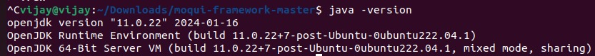
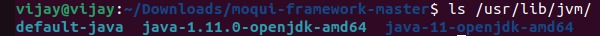
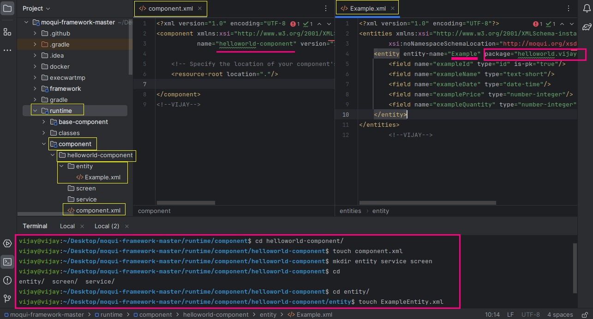
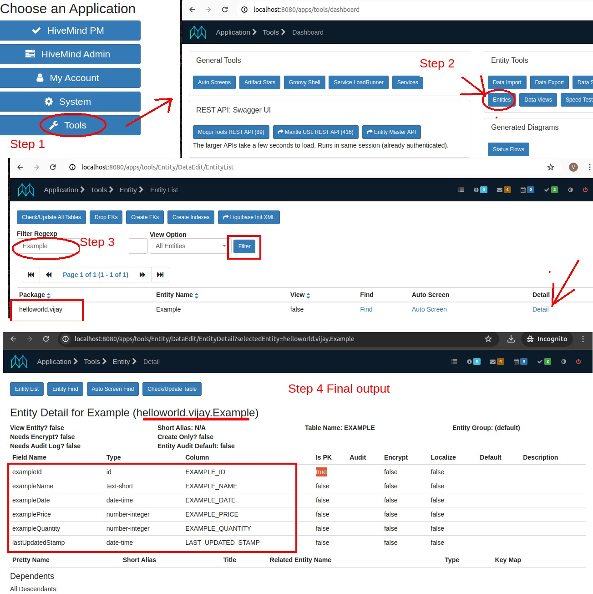

# Video Link(Will Update Soon) 


# Steps I followed 
1)Installed  java 11<br>


<br>
2)Set java home varible in Bash rc file of linux <br>
- ls /usr/lib/jvm/ <br>
- nano ~/.bashrc    <br>
- export JAVA_HOME=/usr/lib/jvm/java-11-openjdk-amd64  <br>
- export PATH=$PATH:$JAVA_HOME/bin  <br>
- source ~/.bashrc <br>
- echo $JAVA_HOME  <br>
- echo $PATH  <br>
  <br>

<br>
3) Project Run and Deploy<br>
- Clone the Git hub repo : git clone url <br>  
  https://github.com/moqui/moqui-framework<br>
- Go to terminal and run these commands : <br>
 ./gradlew getComponent -Pcomponent=HiveMind<br>
 ./gradlew build<br>
 ./gradlew load<br>
 ./gradlew addRuntime<br>
 ./gradlew load run <br>
- Acess aplication at <br>
  http://localhost:8080/ <br>

4) Assignment Steps :<br>
- go to component folder and run commands  :<br>

  mkdir helloworld-component<br>
  cd helloworld-component/<br>
  touch component.xml<br>
  mkdir entity service screen<br>
  cd entity/<br>
  touch ExampleEntity.xml<br>

<b>(Note : Rename ExampleEntity to Example As given in assignement Requirements)</b>

- Code for component.xml <br>
```
 
<?xml version="1.0" encoding="UTF-8"?>
<component xmlns:xsi="http://www.w3.org/2001/XMLSchema-instance" xsi:noNamespaceSchemaLocation="http://moqui.org/xsd/moqui-conf-3.xsd"
           name="helloworld-component" version="1.5.0">
    <resource-root location="."/>

</component>

```
<br>

- Code for Example.xml <br> <b>(Note : Rename ExampleEntity to Example As given in assignement Requirements)</b>
```

<?xml version="1.0" encoding="UTF-8"?>
<entities xmlns:xsi="http://www.w3.org/2001/XMLSchema-instance"
        xsi:noNamespaceSchemaLocation="http://moqui.org/xsd/entity-definition-3.xsd">
    <entity entity-name="Example" package="helloworld.vijay" cache="never">
        <field name="exampleId" type="id" is-pk="true"/>
        <field name="exampleName" type="text-short"/>
        <field name="exampleDate" type="date-time"/>
        <field name="examplePrice" type="number-integer"/>
        <field name="exampleQuantity" type="number-integer"/>
    </entity>
</entities>

 ```
<br>

5)Project structure 

<b>(Note : Rename ExampleEntity to Example As given in assignement Requirements)</b>
<br>
6) Project Output 
Run command to deploy on server - 
./gradlew load run
Acess aplication at  - 
  http://localhost:8080/ <br>
Final Require OutPut :



